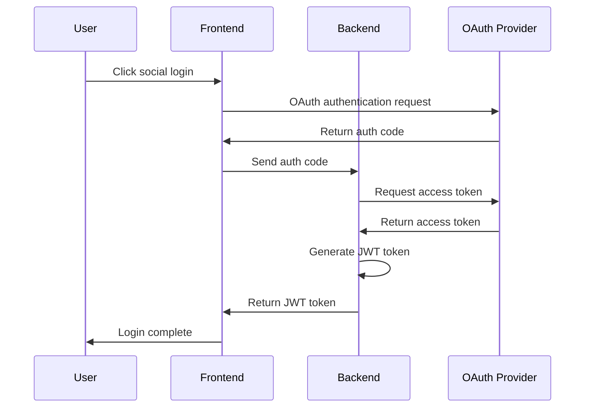
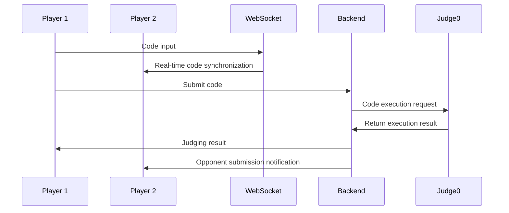

# 🏁 CodeRacer - Real-time Coding Competition Platform

## 📋 Project Overview

**CodeRacer** is a web-based coding platform that enables developers to compete in real-time by solving algorithmic problems. Built around LeetCode problems, it provides real-time coding competitions, multi-language support, and administrative features, allowing developers to enhance their coding skills through competitive learning.

## ✨ Key Features

### 🚀 Real-time Coding Competition

- **WebSocket-based Real-time Communication**: Monitor opponent's code input in real-time
- **Simultaneous Problem Solving**: Compete on speed and accuracy while solving the same problem
- **Real-time Judging**: Immediate code execution results through Judge0 integration

### 📚 LeetCode Integration

- **Multiple Difficulty Levels**: Easy, Medium, and Hard problems
- **Problem Management System**: Admins can add and modify new problems
- **Automated Judging**: Automatic evaluation considering accuracy and execution time

### 🌍 Multi-language Support

- **JavaScript/TypeScript**: Web developer friendly
- **Python**: Suitable for data science and algorithm learning
- **Go**: High-performance systems programming
- **Java**: Enterprise development environment
- **C++**: Optimal for algorithm competition preparation

### 👑 Administrative Features

- **Admin Role**: Special privileges for administrator accounts
- **Problem CRUD**: Create, Read, Update, Delete LeetCode problems
- **User Management**: User permissions and status management

### 🔐 Authentication System

- **Social Login**: Google and GitHub OAuth support
- **JWT-based Authentication**: Secure session management
- **Role-based Access Control**: Admin/User permission separation

## 🛠 Technology Stack

### Frontend

| Technology       | Version | Purpose                                  |
| ---------------- | ------- | ---------------------------------------- |
| **Next.js**      | 13+     | React-based full-stack framework         |
| **TypeScript**   | Latest  | Type safety and development productivity |
| **Tailwind CSS** | Latest  | Utility-first CSS framework              |
| **Zustand**      | Latest  | Lightweight state management             |
| **CodeMirror**   | Latest  | Code editor component                    |
| **shadcn/ui**    | Latest  | Reusable UI components                   |

### Backend

| Technology      | Version | Purpose                            |
| --------------- | ------- | ---------------------------------- |
| **Go (Golang)** | 1.25+   | High-performance backend server    |
| **Gin**         | Latest  | HTTP web framework                 |
| **GORM**        | Latest  | Go ORM library                     |
| **PostgreSQL**  | 14+     | Primary database                   |
| **Redis**       | 6+      | Cache and session management       |
| **Judge0**      | Latest  | Code execution and judging service |

## 🏗 Architecture Design

### Frontend Architecture

```
┌─────────────────┐    ┌─────────────────┐    ┌─────────────────┐
│   Pages Layer   │    │ Components Layer│    │   State Layer   │
│                 │    │                 │    │                 │
│ • Game Room     │◄──►│ • Code Editor   │◄──►│ • Zustand Store │
│ • Problem Page  │    │ • Language Sel  │    │ • Auth Context  │
│ • Admin Panel   │    │ • Theme Selector│    │ • Game State    │
└─────────────────┘    └─────────────────┘    └─────────────────┘
         │                       │                       │
         └───────────────────────┼───────────────────────┘
                                 │
                    ┌─────────────────┐
                    │   API Layer     │
                    │                 │
                    │ • REST API      │
                    │ • WebSocket     │
                    │ • Auth Service  │
                    └─────────────────┘
```

### Backend Architecture

```
┌─────────────────┐    ┌─────────────────┐    ┌─────────────────┐
│   HTTP Layer    │    │  Business Layer │    │  Data Layer     │
│                 │    │                 │    │                 │
│ • Gin Router    │◄──►│ • Game Service  │◄──►│ • PostgreSQL    │
│ • Middleware    │    │ • Judge Service │    │ • Redis Cache   │
│ • Controllers   │    │ • Auth Service  │    │ • GORM ORM      │
└─────────────────┘    └─────────────────┘    └─────────────────┘
         │                       │                       │
         └───────────────────────┼───────────────────────┘
                                 │
                    ┌─────────────────┐
                    │  External APIs  │
                    │                 │
                    │ • Judge0        │
                    │ • OAuth (Google)│
                    │ • OAuth (GitHub)│
                    └─────────────────┘
```

## 🔄 Core Workflows

### 1. User Authentication



### 2. Real-time Game Progression


